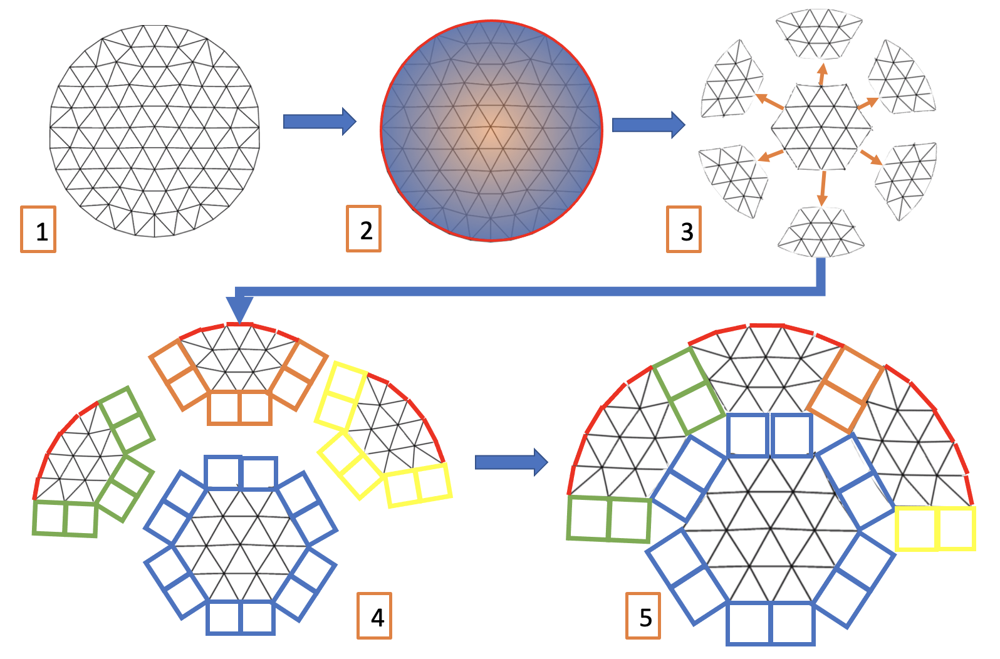

|MIT License| |Version| |PyVersion| |Stability|

::

               ____          __                 _
              / __ \ __  __ / /_   ___   _____ (_)_   __ ___
             / /_/ // / / // __ \ / _ \ / ___// /| | / // _ \
            / ____// /_/ // / / //  __/(__  )/ / | |/ //  __/
           /_/     \__, //_/ /_/ \___//____//_/  |___/ \___/
                  /____/

   A lightweight, flexible python package to insert cohesive elements

About The Project
-----------------

Simple, extensible python library to read a finite element mesh and
insert cohesive elements. Meshes are partitioned into sectors using
METIS mesh partitioner, and cohesive elements are inserted between
partitions. This allows an arbitrary level of insertion (controlled
primarily by the number of partitions) without the user needing to
specify cumbersome face-sets along which to insert.

Supported Mesh Formats
~~~~~~~~~~~~~~~~~~~~~~

   `Abaqus <http://abaqus.software.polimi.it/v6.14/index.html>`__,
   `ANSYS
   msh <https://www.afs.enea.it/fluent/Public/Fluent-Doc/PDF/chp03.pdf>`__,
   `AVS-UCD <https://lanl.github.io/LaGriT/pages/docs/read_avs.html>`__,
   `CGNS <https://cgns.github.io/>`__, `DOLFIN
   XML <https://manpages.ubuntu.com/manpages/disco/man1/dolfin-convert.1.html>`__,
   `Exodus <https://cubit.sandia.gov/public/13.2/help_manual/WebHelp/finite_element_model/exodus/block_specification.htm>`__,
   `FLAC3D <https://www.itascacg.com/software/flac3d>`__,
   `H5M <https://www.mcs.anl.gov/~fathom/moab-docs/h5mmain.html>`__,
   `Kratos/MDPA <https://github.com/KratosMultiphysics/Kratos/wiki/Input-data>`__,
   `Medit <https://people.sc.fsu.edu/~jburkardt/data/medit/medit.html>`__,
   `MED/Salome <https://docs.salome-platform.org/latest/dev/MEDCoupling/developer/med-file.html>`__,
   `Nastran <https://help.autodesk.com/view/NSTRN/2019/ENU/?guid=GUID-42B54ACB-FBE3-47CA-B8FE-475E7AD91A00>`__
   (bulk data), `Neuroglancer precomputed
   format <https://github.com/google/neuroglancer/tree/master/src/neuroglancer/datasource/precomputed#mesh-representation-of-segmented-object-surfaces>`__,
   `Gmsh <http://gmsh.info/doc/texinfo/gmsh.html#File-formats>`__
   (format versions 2.2, 4.0, and 4.1),
   `OBJ <https://en.wikipedia.org/wiki/Wavefront_.obj_file>`__,
   `OFF <https://segeval.cs.princeton.edu/public/off_format.html>`__,
   `PERMAS <https://www.intes.de>`__,
   `PLY <https://en.wikipedia.org/wiki/PLY_(file_format)>`__,
   `STL <https://en.wikipedia.org/wiki/STL_(file_format)>`__, `Tecplot
   .dat <http://paulbourke.net/dataformats/tp/>`__, `TetGen
   .node/.ele <https://wias-berlin.de/software/tetgen/fformats.html>`__,
   `SVG <https://www.w3.org/TR/SVG/>`__ (2D only, output only),
   `SU2 <https://su2code.github.io/docs_v7/Mesh-File>`__,
   `UGRID <http://www.simcenter.msstate.edu/software/downloads/doc/ug_io/3d_grid_file_type_ugrid.html>`__,
   `VTK <https://www.vtk.org/wp-content/uploads/2015/04/file-formats.pdf>`__,
   `VTU <https://www.vtk.org/Wiki/VTK_XML_Formats>`__,
   `WKT <https://en.wikipedia.org/wiki/Well-known_text_representation_of_geometry>`__
   (`TIN <https://en.wikipedia.org/wiki/Triangulated_irregular_network>`__),
   `XDMF <http://www.xdmf.org/index.php/XDMF_Model_and_Format>`__.

Mesh I/O is facilitated by
`meshio <https://github.com/nschloe/meshio>`__, see meshio documentation
for up-to-date list of supported mesh formats.

Built With
----------

-  `numpy <https://numpy.org/>`__
-  `scipy <https://www.scipy.org/>`__
-  `pymetis <https://github.com/inducer/pymetis>`__
-  `meshio <https://github.com/nschloe/meshio>`__

Getting Started
---------------

To get a local copy up and running follow these simple steps.

Installation
~~~~~~~~~~~~

Install via `pip <https://pypi.org/project/pyhesive/>`__

.. code:: sh

   $ python3 -m pip install pyhesive

Or clone the repository and install an editable copy from ``setup.py``

.. code:: sh

   $ git clone https://gitlab.com/Jfaibussowitsch/pyhesive.git
   $ cd pyhesive
   $ python3 -m pip install -e .

Example Usage
~~~~~~~~~~~~~

[**RECOMMENDED**] Command line script

.. code:: sh

   $ pyhesive-insert -n 15 /path/to/mesh/file

Additional commmand line arguments are listed via

.. code:: sh

   $ pyhesive-insert --help

The tool is also fully functional via Python module import

..
   If you change this, don't forget to make pyhesive/test/test_example.py
   match!

.. code:: python
          
   import pyhesive as pyh

   # create the mesh from plain old data
   mesh = pyh.Mesh.from_POD(points,cells,copy=True)

   # create partitions
   number_of_partitions = 2 # for example
   mesh.partition_mesh(number_of_partitions)

   # insert elements between partitions
   mesh.insert_elements()

   # write to file, for example in abaqus format
   # '.inp' extension is automatically appended
   output_file_name = my_mesh_dir/"cohesive_mesh"
   mesh.write_mesh(output_file_name,mesh_format_out="abaqus")

Testing
-------

To run the test suite, make sure you have
`pytest <https://docs.pytest.org/en/6.2.x/>`__ and
`vermin <https://pypi.org/project/vermin/>`__ installed. Then clone the
repository, and run `pytest <https://docs.pytest.org/en/6.2.x/>`__ from
the project directory. Alternatively one can also run ``make test`` to
test additional features such as package upload, installation and
minimum Python version.

.. code:: sh

   # to run just the correctness tests
   $ pytest
   # to run all tests
   $ make test

Acknowledgments
---------------

This project is supported by the `Center for Exascale-enabled Scramjet
Design (CEESD) <https://ceesd.illinois.edu/>`__ at the University of
Illinois at Urbana-Champaign.

This material is based in part upon work supported by the Department of
Energy, National Nuclear Security Administration, under Award Number
DE-NA0003963.

.. raw:: html

   <!-- https://www.markdownguide.org/basic-syntax/#reference-style-links -->

.. |MIT License| image:: https://img.shields.io/pypi/l/pyhesive
   :target: https://gitlab.com/Jfaibussowitsch/pyhesive/-/blob/master/LICENSE
.. |Version| image:: https://img.shields.io/pypi/v/pyhesive
   :target: https://pypi.org/project/pyhesive/
.. |PyVersion| image:: https://img.shields.io/pypi/pyversions/pyhesive
   :target: https://www.python.org/downloads/
.. |Stability| image:: https://img.shields.io/pypi/status/pyhesive
   :target: https://pypi.org/project/pyhesive/
